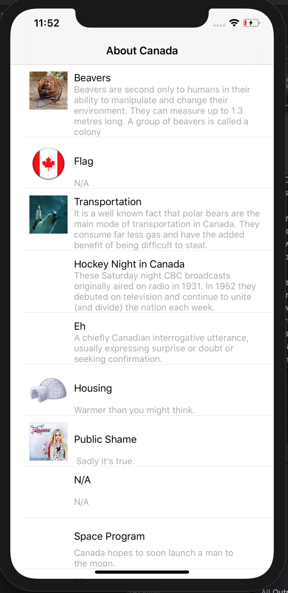
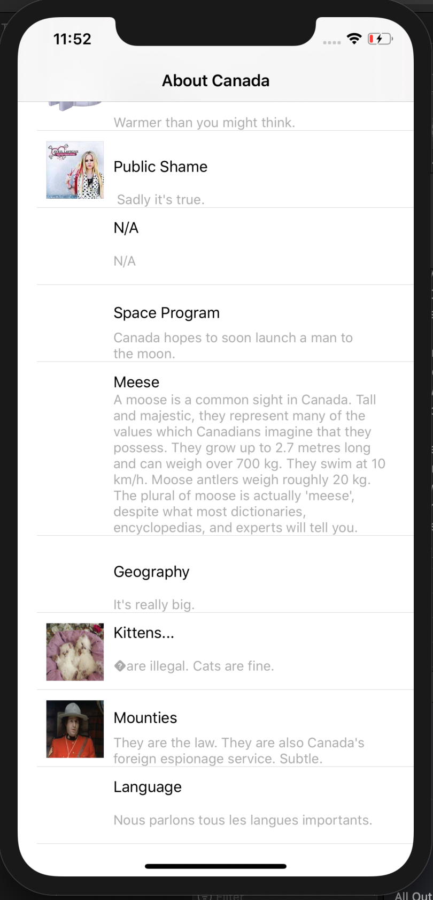
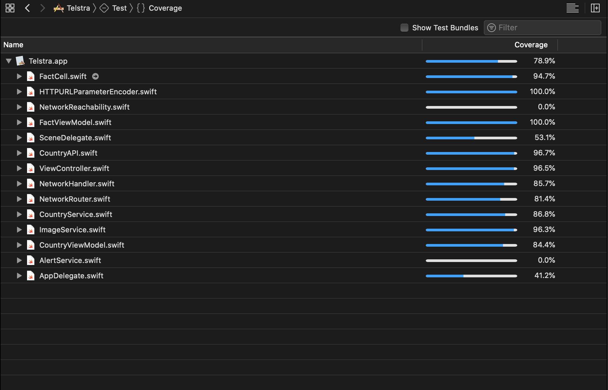

# Telstra.iOS

========

This repository contains  an app that uses the Country data API and shows the fact results in a list view.

## Sample Screens

## Getting Started

These instructions will get you a copy of the project up and running on your local machine for development and debugging purposes.

### Prerequisites

You would need a macbook with XCode 11.x installed. 

### Installing Builds

- To be able to install the build on the iPhone you will be needing Apple Developer provisioning and certifcate. You can create your Apple developer account [here](https://developer.apple.com/).
- You can create build on iOS 13.x or later simulator provided with the XCode 11.x or later.
- To run the project Navigate to the *Telstra.iOS* folder on your machine where you cloned it. And open the project using *Telstra.xcodeproj* file.

## User Guide to use the app
- On Launch if app is connected to the internet it will list view with fact results.
- List view also have ability of *Pull to refresh*.

## Technical Details

### Third Party
- There is no third party library used as to minimise issues while using this as a library project. 

### App Architecture
- MVVM Architecture is used in the app.
- Network layer is based on protocol oriented design.

### Code Structure
Code is divided into following Groups
- Constants group contains AppConstants file which stores all the constants used across the app.
- Network group contains all the files related to network layer.
- Models group contains the *Country* model being used in the app.
- Source group contains the Country & Fact modules.

### Unit Tests
- Unit test are written and provide a code coverage of 80 percent. see the screenshot attached.

- Unit tests are arranged to test View Model and Network Service. 

Following test cases are written:
- Country Service test for checking if facts list fetched correctly.
- CountryViewModelTest for testing CountryViewModel with a mock json file to make sure view model behaves correctly.
- Url encoding test for URLEncoder to see if urls are being configured correctly.

## Built With
- XCode 11.3.1
- Tested on iPhone 11 Pro Max. (iOS 13.1.3)

## Future improvements 

* UI design can be improved.
* Internet availability can be added in service layer.
* More animations can be added.
* Can be added more error handling for response object. 
* Use pragma marks to help anyone that will have to understand and work with the code navigate easier through the class.
* Comments on the methods to offer better understanding.
